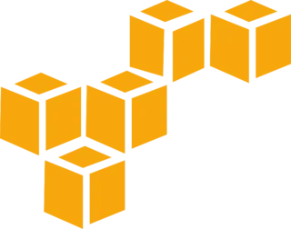
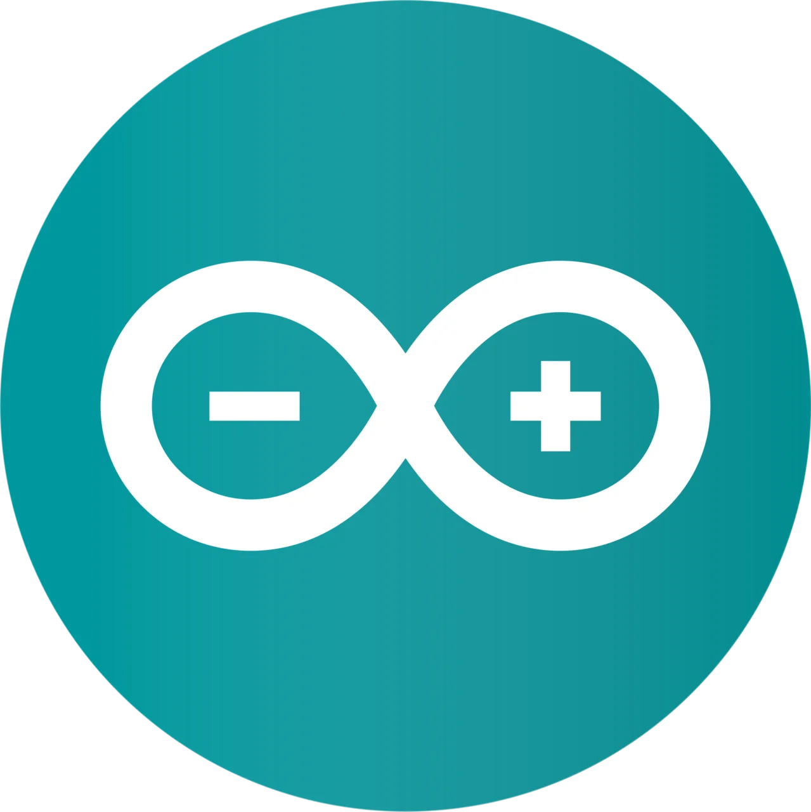
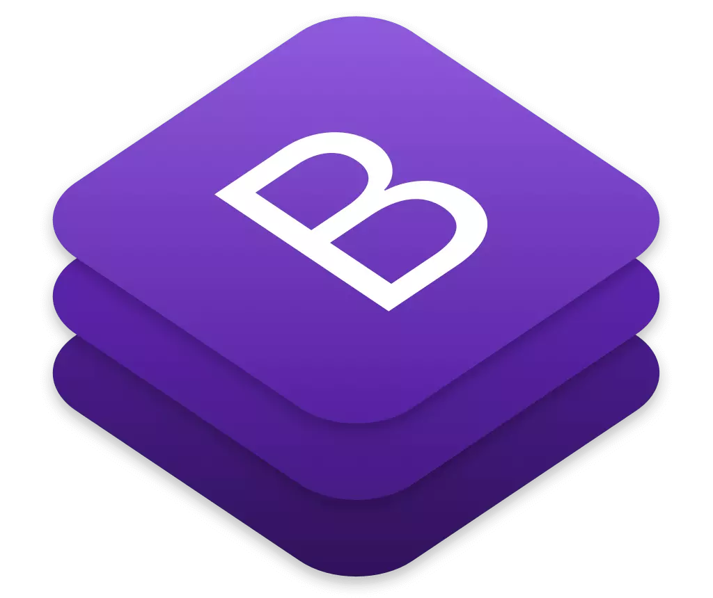
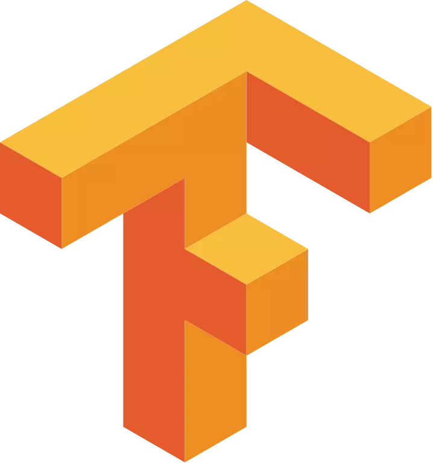
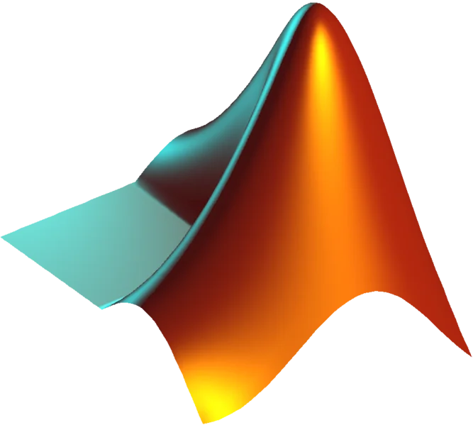
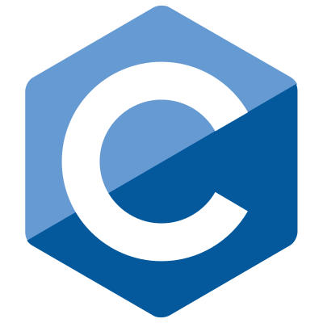
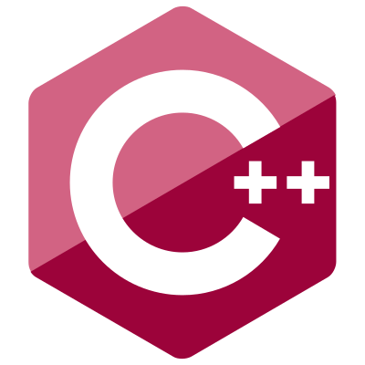

#  Hello !  

  
⚡ Fun fact: I'm an Electronics student wandering into unknown territory
  

# 💻 Stack

  
  
  
  
  
  
  
   
  
  
  
  
  
  
  
  
   
  
  
  
  
  
  
  
 

<!--
| | | | | 
| :----: | :----: | :----: | :----: | 
|  |  |  |  |
|   |   |  |   |
|   |  |   |  |
|   |  |  |  | 
-->
 

# 📊 Github Stats 

 

 

